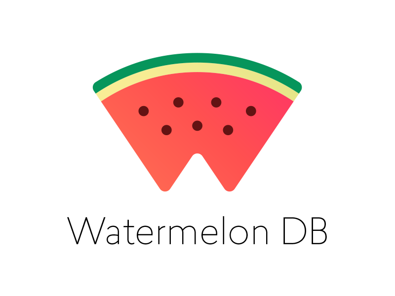

  

## Options (Offline Mode) 📴

<table>
  <tr>
    <td>
      
    </td>
    <td>
      
    </td>
  </tr>
</table>

## Credits 👍
* **React Native Template TypeScript:** [👾 Clean and minimalist React Native template for a quick start with TypeScript.](https://github.com/react-native-community/react-native-template-typescript)

## Supporting 🍻
I believe in Unicorns 🦄
Support [me](http://www.paypal.me/jdnichollsc/2), if you do too.

## Happy coding 💯
Made with ❤️

